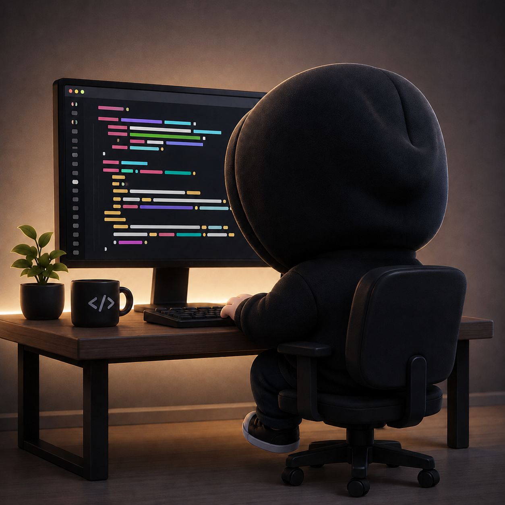

<table>
  <tr>
    <td width="55%" valign="middle">

<h1>Olá, eu sou o Itallo 👋</h1>

Crio interfaces modernas, apps e produtos digitais minimalistas.

Atualmente focado em <b>Front-end</b>, <b>UI Design</b>, <b>dashboards</b> e <b>apps mobile-first</b>.

  
  
  
  
  
  
  
  
  

</td>
<td width="45%" align="center" valign="middle">

</td>
  </tr>
</table>

---

## Projetos

**Elite Coach**  
Sistema para professores acompanharem alunos, avaliações, agenda e evolução esportiva.

**Dashboard Financeiro**  
Interface para organização financeira pessoal com gráficos e visão mensal.

**Linkstore**  
Projeto de e-commerce/redirect com foco em visual limpo e moderno.

---

  Construindo um projeto de cada vez.

